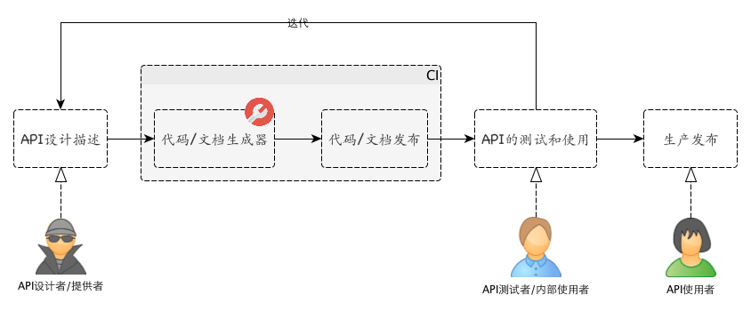

% API Design And Documentation
% [陨石 - yunshi@wacai.com](mailto:yunshi@wacai.com)
% 2015-03-17

# Why we need API design and documentation

HTTP API ^[现在很多地方都使用REST API这个术语， 不过注意这里使用的是HTTP API，至于为什么， 嘿嘿，自己意会吧 ;-)] can't be typesafe as per the http protocol's essential， so we need to find a way so that the api providers and consumers can come to the same rendzvous point with proper constraits and clarity.

HTTP协议的特性决定了基于HTTP的API属于松散类型（与强类型或者说类型安全的API相对应）， 为了能够让API的提供者和消费者可以一种双方都可以明晰且明确的方式达成共识， 我们需要找到一种方式来描述API，以便对双方进行一定的约束，从而形成一种双方都可以遵守的契约式的协议， 在某些层面增加少许工作量的同时，为双方提供便利和参考。

# How API design and documentation work

API设计的一般的思路是，API提供者根据某种语法规范，表达和编写相应的API， 然后使用对应这种语法规范的工具解析并生成指定格式的API文档， 当然， 更进一步， API的实现代码也可以一并生成。

生成的文档以及代码可以发布到版本控制系统以及相应的web站点， 然后API的使用者或者说消费者根据发布的API文档作为参考， 使用指定的API规范访问开放的API服务。

或者引用一下apiary的流程：

思路上稍微存在一些差异（即是否生成代码），但先从API设计入手，然后迭代，最终发布这样的大体流程是类似的。

当然， 围绕着这个典型的流程， 很多解决方案可以进一步提供一些周边的工具支持， 比如便于测试的工具， 便于版本化管理的支持， 图形化的API编辑工具， 对应的客户端API服务调用代码的生成工具， 等等。

# Available Solutions

只挑几种，但不限于：

1. [Swagger](http://swagger.io/)
	- 使用json风格的API描述，支持比较全面， 名声相对来说更响一些
2. [apiary](http://apiary.io/how-it-works)
	- 使用markdown风格的API描述, 遵循`API Blueprint`规范
3. [postman](http://www.getpostman.com/)
	- 支持测试的客户端工具貌似很不错

# Minor Cons

将API设计描述放在实现类注释(comment)中，然后通过工具解析抽取并生成文档是保持文档和代码同步的最便捷方式，也更容易集中于一点进行维护，但灵活度会收到原有语言语法的限制。

前者对于强类型语言的实现方案比较合适，而使用结构化的文本来描述API设计，则更灵活，唯一的不足可能文档的更新同步某些时候会不够及时，当然， 如果完全遵循API design and documentation的思路和流程，则可以尽可能的规避这一不足。

# 小结

个人是markdown粉儿，但萝卜白菜各有所爱， 看官喜欢什么口味选择什么口味就好了， 以上方案大体上都可以满足基本的需求。

# References
1. [KNOW YOUR HTTP status codes WELL](https://github.com/for-GET/know-your-http-well/blob/master/status-codes.md)
2. [Hello World Product API With Blueprint, RAML And Swagger](http://apievangelist.com/2014/03/08/hello-world-product-api-with-blueprint-raml-and-swagger/)  - 这篇贵在提供了三种API design方案的对比
	- [API Design Tooling From **Swagger**](http://apievangelist.com/2014/02/25/api-design-tooling-from-swagger/)
	- [API Design Tooling From **RAML**](http://apievangelist.com/2014/03/01/api-design-tooling-from-raml/)
	- [API Design Tooling From **API Blueprint**](http://apievangelist.com/2014/02/27/api-design-tooling-from-api-blueprint/)
		- [API Blueprint Mock Server - Java based API Blueprint mock server, with J2SE and Android* support.](https://bitbucket.org/outofcoffee/api-blueprint-mockserver)
3. [AUTOMATED DOCUMENTATION FOR REST APIS](http://www.programmableweb.com/news/automated-documentation-rest-apis/2012/03/28)
4. [GitHub API v3](https://developer.github.com/v3/)
5. [How do you document your APIs?](http://www.infoq.com/research/api-documentation)
	- 除了常见的几种方案，这篇还提供了其它方案的信息链接

