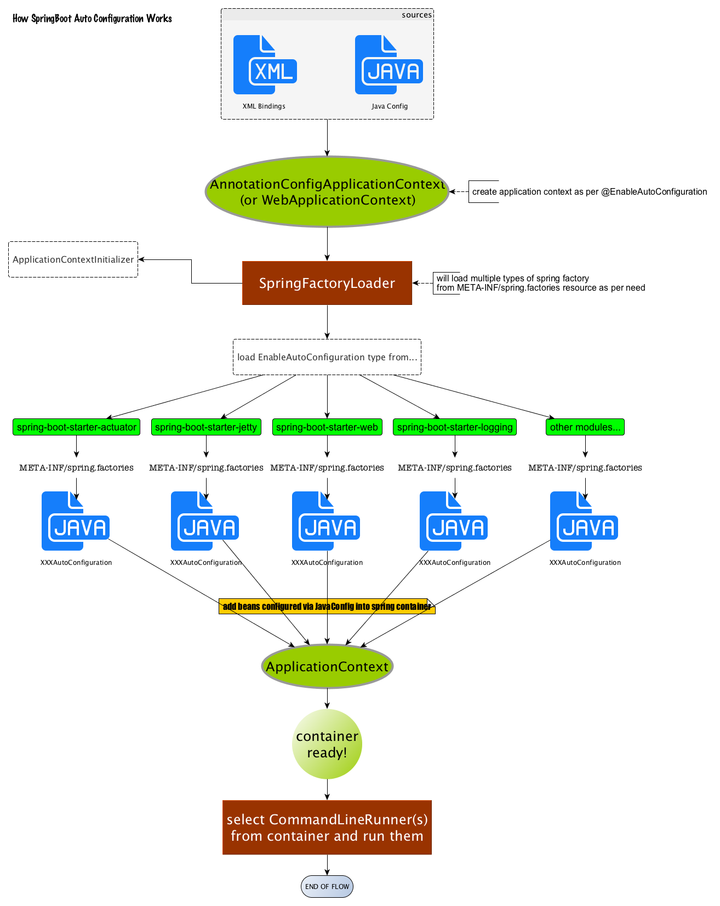

% Spring Boot Rock'n'Roll
% FuqiangWang - fujohnwang AT gmail DOTA com
% 2015-07-09

# SpringBoot Intro

[SpringBoot](http://projects.spring.io/spring-boot/)是顺应现在微服务（MicroServices）理念而产生的一个微框架（同类微框架可供选择的还有[Dropwizard](https://dropwizard.github.io/)）， 用来构建基于Spring框架的标准化的独立部署应用程序（“再也tmd不用寄人篱下，活在WebContainer的屋檐下了”）。

> 我们原来选择试用Dropwizard作为Web API的标准框架， 也完成了一些项目，总体上来说， Dropwizard是可以满足这些场景的，且它对metrics的支持尤其优秀。从技术因素 ^[Dropwizard的做事方式对于Senior来说是OK的，但还是处于半自动状态，很多东西需要自己装配，技术选型很优秀，但拼整体的时候，就有些力有不歹]上来说， Dropwizard是OK的， 但结合公司内部和外部层面其它更多因素考虑，则选型Dropwizard可能不是最合适的做法。
> 
> 我们还是一个比较年轻的团队， 大家有很好的上进意愿，而且我们有优秀的技术leader来带领他们前行，但罗马不是一天建成的，所以， 现在大家还是对现在java生态圈中流行的技术更为熟悉，比如Spring， MyBatis等口口相传的开源框架，如何让大家在现有经验积累的前提下高效完成工作是我们目前的主要目标， 预留20%的空间给团队和个人成长应该是第二目标，而且， Spring社区已经足够成熟， 可以持续完善和支撑现有技术方案与社区成长，故此，我们决定使用SpringBoot来作为我们的微框架，以标准化支持我们的微服务战略。

# SpringBoot Quickstart

我们使用Maven构建项目，所以新建一个maven项目， pom.xml中添加如下两个关键因素：

~~~~~~~ {.xml}
<parent>
    <groupId>org.springframework.boot</groupId>
    <artifactId>spring-boot-starter-parent</artifactId>
    <version>1.2.5.RELEASE</version>
</parent>
...
<dependencies>
    <dependency>
        <groupId>org.springframework.boot</groupId>
        <artifactId>spring-boot-starter-web</artifactId>
    </dependency>
</dependencies>
~~~~~~~

使用spring-boot-starter-parent作为当前项目的parent可以享受到spring boot应用相关的一系列依赖(dependency)， 插件(plugins)等装备， 而添加spring-boot-starter-web这个依赖，则纯粹是我们希望构建一个独立运行的web应用而已(注意， 没有version元素定义，因为spring-boot-starter-parent已经提供了相应的dependencyManagement)。

有了以上配置，我们就可以按照SpringMVC的套路添加相应的Controller实现就可以了， 比如：

~~~~~~~ {.java}
// let's say, it is under package com.xxx.controller

@Controller
public class HelloController {
    @RequestMapping("/")
    @ResponseBody
    String home() {
        return "Hello SpringBoot!";
    }
}
~~~~~~~

最后，要让SpringBoot可以独立运行和部署，我们需要一个Main方法入口， 比如：

~~~~~~~ {.java}
// let's say, it's located under package com.xxx

@SpringBootApplication
public class HelloSpringBoot {
    public static void main(String[] args) throws Exception {
        SpringApplication.run(HelloSpringBoot.class, args);
    }
}
~~~~~~~

That's it, 剩下的就是运行HelloSpringBoot, 然后打开浏览器，访问路径`http://localhost:8080`看看发生了什么吧！^[默认运行嵌入的tomcat，所以使用默认的8080端口]

是不是很简单？ 是啊， 不过也太过于简单了(Everything Should Be Made as Simple as Possible, But Not Simpler)， 如果仅止步于次， 那我们这些自称为技术精英的人们还有什么颜面活在这个世上那？ 我们要深挖洞，广积粮...

# How Spring Boot Works？

要让一个开源软件产品在公司内部落地并成长乃至成熟， 需要我们投入精力来熟悉它， 打磨和完善它，然后才是使用它来简洁高效的交付相应的软件产品乃至高效运维之。

为了能让SpringBoot落地生根发芽，让我们先来了解它是如何工作吧！

## Spring Features Revisited 

作为使用Spring框架的老一辈技术革命家之一， 哥已经脱离应用开发一线多年， 虽然Spring框架从根儿上没有什么变化，但从哥那时起也已经发展了2，3个大的版本了， 所以，在深入SpringBoot之前，有必要先了解一下新版本Spring中那些相关的特性来铺垫铺垫...

> 如果各位看官从开始就一直在使用较新或者最新的Spring框架的话，可以忽略这部分内容，直接从"Understanding @EnableAutoConfiguration"章节继续好了， 不过话说回来， 看看也是好的嘛 ^_-

### XML Configuration VS. JavaConfig

哥是从Spring使用xml做依赖注入和绑定的那个时代走出来的，对xml形式的配置会比较清楚也比较“情有独钟”一些，但并非说排斥其它形式，只是会根据情况来权衡。比如SpringBoot倡导基于JavaConfig的形式来“装配”应用， 但有些层面，我们还是希望根据公司的生态圈和基础设施现状，对其进行一些定制，以便更好的融入并享受一系列生态， 这就会加一些已有系统的集成啦， 对SpringBoot原来的Convention进行Configuration明确化调整啦等等， 而大部分要集成外部已有系统的时候， 通过xml集中明确化配置我认为是比较合适的做法。 

总之， 这两种方式不应该是东风压倒西风，而应该根据情况来选择。 从我的角度来讲，我希望在SpringBoot里，除了Main入口类和autoscan相关的地方使用JavaConfig， 其它最好以xml配置，然后像一个bag似的，可以到处背着到处搬， 反正也不知道这个比喻各位看官能否看明白 ;)

### @Configuration

@Configuration这个Annotation就是JavaConfig的典型代表啦，标注了这个Annotation的Java类定义会以Java代码的形式（对应于xml定义的形式）提供一系列的bean定义和实例， 结合AnnotationConfigApplicationContext和自动扫描的功能，就可以构建一个基于Spring容器的Java应用了。

一系列标注了@Configuration的Java类的集合，对应于“昨日”的一系列xml配置文件。

### @ComponentScan

@ComponentScan对应xml时代的`<context:component-scan>`, 用来扫描classpath下标注了相应Annotation的bean定义，然后加载到Spring容器之中。

一般配合@Configuration来使用， 你可以将@Configuraiton做的事情是纯手工定义bean然后添加到Spring容器， 而@ComponentScan则是自动收集bean定义并添加到Spring容器。

### @Import
Spring容器的配置可以分散在多个物理存在的配置类或者配置文件中， @Import允许将其它JavaConfig形式的配置类引入到当前的@Configuration标注的配置类当中， 对应于原来xml时代的`<import/>`, 甚至于也可以通过@ImportResource将xml形式定义的配置也引入当前JavaConfig形式的配置类当中。

### @PropertySource
配合@Configuration使用， 用来加载.properties内容到Environment，比如：`@PropertySource("classpath:/application.properties")`，当然，要生效， 同时需要容器中配置一个PropertySourcesPlaceholderConfigurer。

@PropertySource和@PropertySources的区别在于， 后者属于前者的Aggregation类型， 在有多个.properties资源需要引入的情况下，如果能够使用Java8的repeatable annotation特性，则只需要声明多个@PropertySource就行了， 否则，作为fallback方案，使用@PropertySources然后再其中引用多个@PropertySource好了。

### Environment和Profile

这两个概念应该是Spring3时代引入的， Environment用来统一表达当前应用程序运行环境的概念，会以Properties的形式提供一系列该环境下的上下文信息，而且允许当前应用程序获取activeProfile是哪个。

说实话， Environment的设计，我觉得到提供上下文信息这一关键职能就可以了， 而Profile的设计，则有些太过于Monolithic时代的做事风格。 Profile一般用来提供某些灵活性， 但这种灵活性是内部化的， 这意味着， 你的软件实体需要知道外面可能提供多少种profiles， 然后在不同的profile下，我的软件实体需要做什么样的调整。 而实际上， 软件实体从研发到交付和使用， 最好是在整条流水线上设计和生产都是一致， 只有“销售”之前，才根据目标环境或者目标客户调整“包装”和配置， 然后“发货”， 用户拿到手的产品(当然包括我们搞的软件产品)应该是开箱即用的， 这个产品既不会存在我不需要的功能，也不应该每次使用的时候先自己“很智能”的扫描一下上下文环境然后决定使用哪一个Profile。尤其是在微服务时代，随着你服务数量的增长，  `服务数量 * Environment数量 * 所谓的Profile数量`更是指数级增长 ^[注意很多时候Profile不一定与Environment相对应, 估计很多开发人员看到文档后并没有完全理解概念，只是照葫芦画瓢，导致profile概念现在大面上被滥用/用坏]， 如果应用开发的时候还要考虑这么多，那出问题的几率就更大了。

所以， 在Microservices时代，我们更建议外部化你的软件产品差异化配置管理， 尽量减少Profile的滥用甚至不用(这就减少一个纬度的管理)。

## Understanding @EnableAutoConfiguration

在本文之前提到的所有Annotation都属于SpringFramework提供的， 现在要说的这个Annotation，即@EnableAutoConfiguration， 则属于SpringBoot。

@EnableAutoConfiguration的定义信息如下：

~~~~~~~ {.java}
@Target(value=TYPE)
@Retention(value=RUNTIME)
@Documented
@Inherited
@Import(value={org.springframework.boot.autoconfigure.EnableAutoConfigurationImportSelector.class,org.springframework.boot.autoconfigure.AutoConfigurationPackages.Registrar.class})
public @interface EnableAutoConfiguration
~~~~~~~

标注了这个Annotation的配置类将触发一系列动作， 也是SpringBoot“黑魔法”的核心， 魔法大体上是这样发生的： SpringBoot一旦发现@EnableAutoConfiguration， 那么就使用Spring框架提供的SpringFactoriesLoader这个特性去扫描当前应用classpath下所有`META-INF/spring.factories`元信息配置， 然后根据当前使用场景需要， 加载符合当前场景需要的配置类型并供当前或者后继流程使用， 对于@EnableAutoConfiguration的场景，就是提取以`org.springframework.boot.autoconfigure.EnableAutoConfiguration`作为key标志的一系列Java配置类，然后将这些Java配置类中的bean定义加载或者说灌入Spring容器中。

当然， EnableAutoConfiguration通过SpringFactoriesLoader筛选并加载进来的这些Java配置类里面，我们其实还可以进一步对要加载到容器的bean定义进行筛选， 这就会用Spring3系列引入的@Conditional“军团”， 通过像@ConditionalOnClass， @ConditionalOnMissingBean等具体的类型和条件来进一步决定加载还是不加载哪些bean定义。

## Enter Main 

有了上面的这些“前戏”， 下面我们正式进入正题了...

每一个SpringBoot应用都有一个入口类，在其中定义main方法， 然后使用SpringApplication这个类来加载指定配置并运行SpringBoot应用程序， 在很多SpringBoot的介绍中，都会使用当前入口类既作为配置（标注@Configuration）又作为入口类， 比如我们的HellSpringBoot:

~~~~~~~ {.java}
@SpringBootApplication
public class HelloSpringBoot {
    public static void main(String[] args) throws Exception {
        SpringApplication.run(HelloSpringBoot.class, args);
    }
}
~~~~~~~

@SpringBootApplication等效于@Configuraiton + @EnableAutoConfiguration + @ComponentScan, 所以， 当我们将HelloSpringBoot.class作为JavaConfig配置类传入SpringApplication.run方法之后， SpringApplication.run方法就知道从哪里加载并扫描必要的bean定义了。

现在，剩下的就是要搞清楚SpringApplication.run里面发生了什么：

其实SpringApplication作为一个bootstrap类， 既可以加载JavaConfig形式的配置， 也可以加载XML形式的配置， 然后根据情况下创建相应类型的ApplicationContext实例， 为了简化理解难度，我们以JavaConfig为主线， 那么一般情况下， SpringBoot就会创建一个对应处理JavaConfig形式配置的AnnotationConfigApplicationContext实例（或者如果有Servlet等类，则创建ConfigurableWebApplicationContext）。

然后一个CommandLinePropertySource会被创建且其内容会加载到当前SpringBoot应用的Environment之中（这也就是为什么命令行上提供的参数可以优先覆盖其它配置的原因），当然， 其它的PropertySource这个时候也会随后一起加载然后并到Environment， 然后交给ApplicationContext实例后继使用（不要纠结与代码细节，虽然代码细节里是先做了包括设置env的一些事情然后再创建ApplicationContext实例）。

在ApplicationContext创建的之前和之后， SpringBoot会使用SpringFactoriesLoader这个特性，从当前classpath下所有的META-INF/spring.factories下加载如下类型的一些callback接口并在前中后等不同时机执行：

1. org.springframework.boot.SpringApplicationRunListener
2. org.springframework.context.ApplicationContextInitializer
3. org.springframework.context.ApplicationListener

这些杂事我这里就不细说了， 总是上面提到的事儿做完后，ApplicationContext就正式加载SpringApplication.run方法传入进来的配置了（JavaConfig形式或者XML形式）， 然后，因为我们标注了@SpringBootApplication， 容器会自动完成指定语意的一系列职能，包括@EnableAutoConfiguration要求的事情， 比如， 从SpringBoot提供的多个starter模块中加载JavaConfig配置， 然后将这些JavaConfig配置筛选上来的bena定义加入Spring容器中（即ApplicationContext中）， refresh容器，然后就完事大吉了，一个SpringBoot应用启动完成。

不过，其实最后还有一个关键组件，一般用于扩展， 在容器准备好之后，SpringBoot其实还会根据类型去容器中挑选一批CommandLineRunner， 然后依次执行这些CommandLineRunner， 我们可以根据需求和场景，实现一些自己的CommandLineRunner并添加到容器来对SpringBoot应用进行某种扩展。

以上属于SpringBoot的整部大戏， 希望各位看官受用， ^_-

# Lean SpringBoot

如果你对SpringBoot不甚了解， 或许就会对其`Quick & Dirty`的做事方式有所顾虑， 是不是AutoConfiguration黑魔法加载了过多没必要的配置啊？ 是不是这套框架太简单无法满足需要啊？ 不过， 一旦你了解了SpringBoot， 这些顾虑就会烟消云散了, SpringBoot既提供了丰富的“给养”， 又同时具有足够的灵活度，让我们根据情况对其进行瘦身（make it lean）， 我们先来看丰富的“给养”...

## Get To Know SpringBoot Modules First

SpringBoot提供了很多预先配置好的职能模块，我们可以先来看看这些模块都能为我们做什么，然后再来决定SpringBoot提供的现有功能是否满足我们的需求， 这些模块大体上如下所列：

~~~~~~~ {.xml}
		<module>spring-boot-starter</module>
		<module>spring-boot-starter-amqp</module>
		<module>spring-boot-starter-aop</module>
		<module>spring-boot-starter-batch</module>
		<module>spring-boot-starter-cloud-connectors</module>
		<module>spring-boot-starter-data-elasticsearch</module>
		<module>spring-boot-starter-data-gemfire</module>
		<module>spring-boot-starter-data-jpa</module>
		<module>spring-boot-starter-data-mongodb</module>
		<module>spring-boot-starter-data-rest</module>
		<module>spring-boot-starter-data-solr</module>
		<module>spring-boot-starter-freemarker</module>
		<module>spring-boot-starter-groovy-templates</module>
		<module>spring-boot-starter-hateoas</module>
		<module>spring-boot-starter-hornetq</module>
		<module>spring-boot-starter-integration</module>
		<module>spring-boot-starter-jdbc</module>
		<module>spring-boot-starter-jersey</module>
		<module>spring-boot-starter-jetty</module>
		<module>spring-boot-starter-jta-atomikos</module>
		<module>spring-boot-starter-jta-bitronix</module>
		<module>spring-boot-starter-logging</module>
		<module>spring-boot-starter-log4j</module>
		<module>spring-boot-starter-log4j2</module>
		<module>spring-boot-starter-mail</module>
		<module>spring-boot-starter-mobile</module>
		<module>spring-boot-starter-mustache</module>
		<module>spring-boot-starter-actuator</module>
		<module>spring-boot-starter-parent</module>
		<module>spring-boot-starter-redis</module>
		<module>spring-boot-starter-security</module>
		<module>spring-boot-starter-social-facebook</module>
		<module>spring-boot-starter-social-twitter</module>
		<module>spring-boot-starter-social-linkedin</module>
		<module>spring-boot-starter-remote-shell</module>
		<module>spring-boot-starter-test</module>
		<module>spring-boot-starter-thymeleaf</module>
		<module>spring-boot-starter-tomcat</module>
		<module>spring-boot-starter-undertow</module>
		<module>spring-boot-starter-velocity</module>
		<module>spring-boot-starter-web</module>
		<module>spring-boot-starter-websocket</module>
		<module>spring-boot-starter-ws</module>
~~~~~~~

我不会对所有的starter都进行介绍，只简单挑几个主要的进行简单介绍...

### spring-boot-starter-actuator

这个module提供的东西比较多，都属于外围支撑性功能， 比如：

1. 提供一系列的Endpoints来窥探SpringBoot应用内部的一系列状态并进行监控管理；
2. 提供HealthIndicator来允许对SpringBoot应用进行健康检查；
3. 提供metrics支持；
4. 提供远程shell支持；
5. 提供mbean支持， 等等...

### spring-boot-starter-web

告诉SpringBoot， 哥当前要开发的是一个Web应用，把相应的依赖配置都给我准备好。 

默认SpringBoot会给Web应用配备Tomcat作为嵌入式web容器， 如果你不想用默认的tomcat，而想用jetty，那么可以再声明一个对spring-boot-starter-jetty的dependency，之后SpringBoot中使用的EnableAutoConfiguration会施展黑魔法，帮你搞定替换满足你的愿望。

### spring-boot-starter-logging

告诉SpringBoot， "给哥使用slf4j和logback！"

### 其它starter modules

一般看名字就可以猜个八九不离十了，所以， 留待各位看官自己去挖掘吧~

## Specific Microservice Type Customization

SpringBoot提供的功能倒是蛮丰富的了，但是，你会发现，爽了的同时，整个应用也会看起笨重了些， 比如有人就抱怨说SpringBoot应用启动慢(虽然这不是什么大问题，你生产环境又不会闲着没事经常重启，服务就应该长久，哈哈)， 好在SpringBoot的设计提供了足够的灵活度，让我们可以对其进行裁剪和瘦身。

### DubboMicroServiceAutoConfiguration

很多公司在使用dubbo作为java服务的开发框架，我们也不例外， 所以， 构建基于SpringBoot和Dubbo的微服务属于比较普遍的需求， 要完成这个事情其实很简单，只要提供一个特定于dubbo的自动加载模块就可以了， 比如我们称其为DubboMicroServiceAutoConfiguration（只是举例，非实际生产代码）：

~~~~~~~ {.java}
@Configuration
@Order(Ordered.HIGHEST_PRECEDENCE)
public class DubboMicroServiceAutoConfiguration {

    // 1. Application Bean Definition
    @Bean
    @ConditionalOnMissingBean
    public static DubboApplication dubboApp() {
        return new xxx;
    }
    
    // 2. Registry Bean Definition
    
    // 3. Protocol Bean Definition
}
~~~~~~~

然后， 在pom中添加其依赖就完工了：

~~~~~~~ {.xml}
    <dependency>
        <groupId>com.wacai</groupId>
        <artifactId>spring-boot-starter-dubbo</artifactId>
        <version>...</version>
    </dependency>
~~~~~~~

当然， dubbo跟哥属于一个时代，其实使用JavaConfig来配置还是有些不适应的，而且基本上大部分dubbo服务也都是通过xml形式进行配置的，不过没关系， 退一步讲， 都不需要自动配置模块， 通过convention来约定说我们所有的dubbo项目从src/main/resources/spring/*.xml这样的资源路径来加载容器的配置就可以了， 更他娘的简单！

~~~~~~~ {.java}
@Configuration
@ImportResource("classpath*:/spring/*.xml")
...
public class Main {
    ...
}
~~~~~~~

> 使用的pattern请各位看官灵活把握！

### WebAPIAutoConfiguration

其实对于性能要求不是那么苛刻的场景（大多数应用其实都归于此类）， 我们完全可以只走HTTP就好了， 服务注册中心都现成的经过多年验证的成熟方案（I mean DNS）, 而且，多语言生态下的互通这也是唯一比较合理的一条路， 这就是我现在公司内部一直强调“大部分情况下，互通优于性能”， 只有在特殊需求下，才有必要花费经历对性能去进行优化（比如使用dubbo这种特定于java的方案， 对网络，系统甚至代码等进行调优）。

故此，我们内部除了基于dubbo的微服务，还有web api形式的微服务，我说web api而不是说rest(ful) api， 是因为，虽然后者更高大上， 但对于我们的团队来说， 简单粗暴的做法更容易接受且符合团队现状， hibernate当年搞得映射关系支持的多么牛逼，最后还不是都自己在代码逻辑里管理这些关系， 而几乎只用它最基本的CURD支持吗？！ 存在肯定是有理由的，哈哈

web api的设计我们就不多说了， 建议是采用适合自己团队的做法， 我们来聊正事！

基于SpringBoot提供web api， 我们可以选择基于JavaEE标准的starter模块，比如spring-boot-starter-jersey， 也可以使用高大上的spring-boot-starter-hateoas， 其实基本上不需要自己提供扩展。

#### Web API Documentation

我们可以使用Swagger提供当前Web API的文档。

1. 添加maven依赖

~~~~~~~ {.xml}
        <dependency>
            <groupId>com.mangofactory</groupId>
            <artifactId>swagger-springmvc</artifactId>
            <version>1.0.2</version>
        </dependency>
~~~~~~~

2. src/main/resources目录下添加swagger-ui的相关资源(亲们，自己google大法吧~)

3. 启动类上添加相应配置

~~~~~~~ {.java}
@Configuration
@PropertySource("file:conf/application.properties")
@ImportResource("classpath*:/spring/*.xml")
@EnableAutoConfiguration(exclude = {DataSourceAutoConfiguration.class, DataSourceTransactionManagerAutoConfiguration.class})
@ComponentScan
@EnableSwagger
public class Main {

    private SpringSwaggerConfig springSwaggerConfig;

    @Autowired
    public void setSpringSwaggerConfig(SpringSwaggerConfig springSwaggerConfig) {
        this.springSwaggerConfig = springSwaggerConfig;
    }

    @Bean
    public SwaggerSpringMvcPlugin configureSwagger() {
        ApiInfo apiInfo = new ApiInfo("sample web api", "web api project with spring boot", null, null, null, null);
        return new SwaggerSpringMvcPlugin(this.springSwaggerConfig).apiInfo(apiInfo).useDefaultResponseMessages(false).includePatterns("/*");
    }

    public static void main(String[] args) {
        SpringApplication app = new SpringApplication(Main.class);
        app.setShowBanner(false);
        app.run(args);
    }

}
~~~~~~~

然后通过/index.html路径访问swagger-ui， 然后在api信息查询输入框中输入对应host下的/api-docs路径的URL， 就可以获取相应的API文档信息了。

API文档随同Web API一起发布，fucking amazing!

## DevOps-Specific Customization

系统不是一个个的孤岛， 我们需要连接起来才会发挥更大的效能， 为了让SpringBoot可以融入[挖财](http://www.wacai.com)的技术生态中，我们会对其进行一些定制， 这些定制对各位看官来说不一定有用， 权且作为点滴参考。

### config customization

我们的应用配置采用配置中心 ^[注意，这里的配置中心跟现在技术社区里提到的配置中心是两个概念， 现在技术社区里常常提到的配置中心叫"状态中心"还差不多, 因为本质上他们是在用数据库也好还是zookeeper也罢作为一个共享状态， 然后让相关系统来“参拜”， 而如果系统设计趋于理想化的话，这些状态应该内聚到服务内部， 如果外部要与这些状态交互， 通过消息传递依次或者并行送达相应的消息就好了，只不过， 这对研发人员的要求，对服务治理，安全等都会造成压力，所以大家就都省事，采用了现在SharedState的模式， 当然，也不失为实践的一种合理方式，无绝对好坏]进行管理， 但流程上对研发是透明的， 开发阶段配置文件按照约定放在项目根目录下的conf/目录， 发布包的结构也是同样的，配置文件名采用SpringBoot的默认application.properties即可， 唯一需要调整的配置就是配置文件的加载路径， 这可以在应用启动的时候指定命令行参数搞定：`--spring.config.location=file:conf/`, 或者：

~~~~~~~ {.java}
...
@PropertySource("file:conf/application.properties")
...
public class Main {
    public static void main(String[] args) {
        SpringApplication app = new SpringApplication(Main.class);
        app.setShowBanner(false);
        app.run(args);
    }
}

~~~~~~~

我们还可以提供一个新的AutoConfiguraiton的module， 这个module提供一个新的PropertySource指向我们约定的位置就行了， 具体方案会结合我们的发布平台再选择最为合适的， 可选方案只是为了给大家一些启发思路。

### logging customization

在挖财，我们对日志格式进行了规范， 而且使用logback， 且对日志的输出路径也做了规定，以便所有应用一旦部署就可以自动享受到我们的日志采集分析平台的服务。

SpringBoot因为一些历史原因和向前兼容保持一致性等因素的关系（不知道有没有其它利害）， 一直主要用commons-logging， 我们显然不喜欢这个默认设置，所以， 我们对SpringBoot的日志设定做了一些定制：

1. 添加spring-boot-starter-logging依赖，让spring boot使用logback;
2. 添加logback.xml配置文件，配置规则遵循我们自己的规范；
3. 启动的时候，设置LOG_HOME环境变量或者命令行参数；

# Scala Is Bootiful Too

我们团队有部分精英同学使用Scala语言进行开发， 而对于SpringBoot来说， 使用任何JVM上的语言原则上都不是什么问题， 比如， 要使用Scala进行SpringBoot应用的开发， 只需要添加Scala的相应依赖和编译支持就可以了：

~~~~~~~ {.xml}
<project xmlns="http://maven.apache.org/POM/4.0.0" xmlns:xsi="http://www.w3.org/2001/XMLSchema-instance"
         xsi:schemaLocation="http://maven.apache.org/POM/4.0.0 http://maven.apache.org/xsd/maven-4.0.0.xsd">
    <modelVersion>4.0.0</modelVersion>

    <parent>
        <groupId>org.springframework.boot</groupId>
        <artifactId>spring-boot-starter-parent</artifactId>
        <version>1.2.5.RELEASE</version>
    </parent>

    <groupId>com.wacai</groupId>
    <artifactId>hello-springboot</artifactId>
    <version>1.0-SNAPSHOT</version>
    <packaging>jar</packaging>

    <name>hello-spring-boot</name>
    <url>http://maven.apache.org</url>

    <properties>
        <encoding>UTF-8</encoding>
        <scala.version>2.11.6</scala.version>
    </properties>

    <build>
        <plugins>
            <plugin>
                <groupId>net.alchim31.maven</groupId>
                <artifactId>scala-maven-plugin</artifactId>
                <version>3.2.1</version>
                <executions>
                    <execution>
                        <id>compile-scala</id>
                        <phase>compile</phase>
                        <goals>
                            <goal>add-source</goal>
                            <goal>compile</goal>
                        </goals>
                    </execution>
                    <execution>
                        <id>test-compile-scala</id>
                        <phase>test-compile</phase>
                        <goals>
                            <goal>add-source</goal>
                            <goal>testCompile</goal>
                        </goals>
                    </execution>
                </executions>
                <configuration>
                    <recompileMode>incremental</recompileMode>
                    <scalaVersion>${scala.version}</scalaVersion>
                    <args>
                        <arg>-deprecation</arg>
                    </args>
                    <jvmArgs>
                        <jvmArg>-Xms64m</jvmArg>
                        <jvmArg>-Xmx1024m</jvmArg>
                    </jvmArgs>
                </configuration>
            </plugin>

        </plugins>
    </build>

    <dependencies>
        <dependency>
            <groupId>org.scala-lang</groupId>
            <artifactId>scala-library</artifactId>
            <version>${scala.version}</version>
        </dependency>
        <dependency>
            <groupId>org.scala-lang</groupId>
            <artifactId>scala-compiler</artifactId>
            <version>${scala.version}</version>
        </dependency>
        <dependency>
            <groupId>org.springframework.boot</groupId>
            <artifactId>spring-boot-starter-web</artifactId>
        </dependency>
    </dependencies>
</project>
~~~~~~~

> 如果使用SBT而不是Maven, 可能需要费点儿周折， 需要自己添加一系列的依赖，并且解决按照SpringBoot的可执行jar规范格式发布的问题。

# Distribute SpringBoot Application

SpringBoot提供了相应的Maven插件用于将SpringBoot应用以可执行jar包的形式发布出去， 只要将如下插件配置加入pom即可：

~~~~~~~ {.xml}
<build>
    <plugins>
        <plugin>
            <groupId>org.springframework.boot</groupId>
            <artifactId>spring-boot-maven-plugin</artifactId>
        </plugin>
    </plugins>
</build>
~~~~~~~

允许`mvn package`将直接获得一个可执行的jar包(`java -jar xxxx.jar`)， 具体原理参考SpringBoot的Reference文档附录。

# Conclusion

SpringBoot初看上去颇为复杂，但一旦你了解了它内部的精妙设计， 就会有那种“柳暗花明”的感觉了。本文最后引用的参考连接中使用钢铁侠来类比SpringBoot，我觉得还是挺恰当的， 感觉上很笨重，但实际上却是灵活可拆装， 多种后备组合可供选择， 既有雄厚的商业实体支撑， 还有良好的群众基础， fucking perfect！

SpringBoot， 你值得拥有 ；）

# References

1. [Spring Boot – Simplifying Spring for Everyone](http://spring.io/blog/2013/08/06/spring-boot-simplifying-spring-for-everyone/)
    - 起源性介绍
    - <https://jira.spring.io/browse/SPR-9888> - 起源性issue
2. <http://www.infoq.com/news/2014/04/spring-boot-goes-ga>
3. <http://www.infoq.com/articles/microframeworks1-spring-boot>
4. [Improved support for 'containerless' web application architectures](https://jira.spring.io/browse/SPR-9888)
5. [Why We Do Not Use Spring Boot Auto Configuration](http://dev-blog.xoom.com/2015/03/15/use-spring-boot-auto-configuration/)
6. [CORS support in Spring Framework](http://spring.io/blog/2015/06/08/cors-support-in-spring-framework)
7. [http://www.schibsted.pl/2015/07/spring-boot-and-dropwizard-in-microservices-development/](http://www.schibsted.pl/2015/07/spring-boot-and-dropwizard-in-microservices-development/)