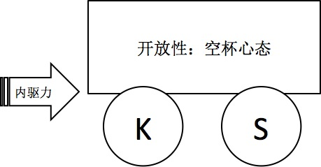

% 上海管理club第一期笔记 (afoo点评版)
% [陨石 - yunshi@wacai.com](mailto:yunshi@wacai.com)
% 2015-02-02

主讲人： 宝鼎

出席人员：海蓝、绿石、福林、寿山、宝珠、零用钱、天琛、宝钗、萤石

旁听生： 陨石

# 关于面试

面试考察一个人的时候，我们重点考察以下两点， 即**学习能力**和**Ownership**

## 学习能力

也有人称之为潜力、可塑性、成长性。为什么考察学习能力？互联网的变化很快，组织必须能够快速反应和执行，员工的学习能力是组织能力提升的基本前提。
考察模型如下图，我们给它取个代号，叫做**宝鼎**牌小汽车 ^[K: Knowledge, S: Smart]。

> afoo点评
> 
> 对于某些内向型人格来讲， 内驱力(Inner force)其实是与生俱来的， 这既是优势也是劣势， 因为这种优势可以让他/她达到某个阶梯的顶峰，却也容易让其自满而不前， 所以， 并不是说只要有内驱力就万事大吉了，还要看他/她驾驭这种优势的能力。 要打破成长的魔咒， 一个最好的做法就是时刻保持谦逊的心态， 即"空杯心态"(Empty The Cup)，一个盛满水的杯子，如果不倒掉，则永远是不变的状态，虽然是满的，但没有更多的空间来接纳新的"活水"， 自然也就到了某个阶段的上限。要突破这个上限，才能获得新的成长，自然的，把原来的满足旧有需要的水倒掉，接纳新的知识， 才会更上一层楼。 但也不是说什么水都要不分优劣的一概接纳，所以要聪明的进行选择。
> 
> "Be Water, My Friends"

## Ownership

为什么考察ownership？

由于市场的变化，业务形态一直会变化，而组织形态也会随之业务形态进行进化调整，但是组织形态的调整相比业务形态的变化会有时间差。当组织的结构落后于需求的变化时，原本的职责都会变化，从而产生无人去own的地带。

下图意在说明组织形态的变化，形状是组织架构，其中每个格子比喻每个人的职责范围。在业务形态已经发生变化而组织形态还没有迅速赶上的时候，有ownership的人主动担当，发挥了重大作用:

* 他们发现问题，并像发动机一样**`推动`**问题的解决。——即使不是来自主管的指示。
* 他们**`无边界`**进行合作，以大局为重不推诿。——即使不是自家门前雪。小例子：主动积极帮助团队内的新人融入、落地。
* 他们能够产出有质量的**`结果`**。——而不是满足于过程的投入与辛苦。

> afoo点评
> 
> 机会永远属于那些敢担当的人！ 虽然我们需要界定每个人的职责边界，使其“私有制产权”得以保护， 从而最大化的发挥各自的效能；但我们同样需要可以顾全大局的人来统筹，在合理权衡各方利益的前提下，为组织拓展更大的成长空间。大部分人盯短期利益的时候， 一定也需要少部分人可以盯中长期利益， 否则这个组织的成长将很难长久甚至繁荣。

# “短时反应”与“系统思考”

案例：1，大街上有个男人打了女人。2，某个合作不久的猎头说你们薪酬没有竞争力？3，若干一贯表现优秀的员工后来变得表现不好。
看到现象，多问几层为什么？根本根源是什么？

> afoo点评
> 
> 所谓"存在即合理"， 与其臆测和抱怨，不如研究它， 搞清楚它， 然后引导它，甚至利用它。训练批判性的独立思考能力，一定不可以偷懒！《思考的快与慢》中，所谓的快思考，实际上是思维上偷懒的表象， 让直觉和经验代替了思考。
> 
> 另外， 在宝鼎牌小汽车中， S代表的Smart， 我们还可以在这里有另一个解读， 即“**要巧思，而非久思**”， 慢思考如果过于慢了，也是不可取的。
> 
> 总之，快餐吃多了不利于自身健康，让自己适当慢下来多问几个why，有利身心健康 ;0)

# 布正道， 养大情

正道：客观公正的管理之道

大情：对组织的爱，对全体伙伴的爱。

主管要客观公正的对员工进行评估，一旦主管丧失客观立场，根据个人好恶来评估成员价值，成员就会要么不把精力投入在工作上去迎合主管，要么因为受到不公平待遇失去对公司的信任而离开.

> afoo点评
> 
> 我们在面试考察的时候，为什么要考察提到的那些维度？因为我们要找的是那些近乎最优秀的人，他们可以自管理，自驱动， 即使在组织还没有能够成熟的时候，也能够为组织的成长贡献正向的力量，而不是成为组织成长的阻力。 但一个组织不能都是由这些优秀的人组成的，前期可以依托“人治”， 但不能在组织成长的任何阶段都这么玩，因为“People are so unreliable”(生化危机2里的台词，借用一下)， 中后期我们要靠合理的制度来制约组织成长过程中难免滋生的不利因素，从而尽最大可能的保持组织的正成长性。 
> 
> 人也好，制度也好， 都不是万能的，二者非排斥关系，而应该是互补的关系，虽然组织的成长终极目标可能都会走向复杂系统的终极目的地（猜猜是啥，嘿嘿）， 但作为组织的管理者和领头羊， 你要做的就是让走向这个终极目的地的过程尽可能的长久。

